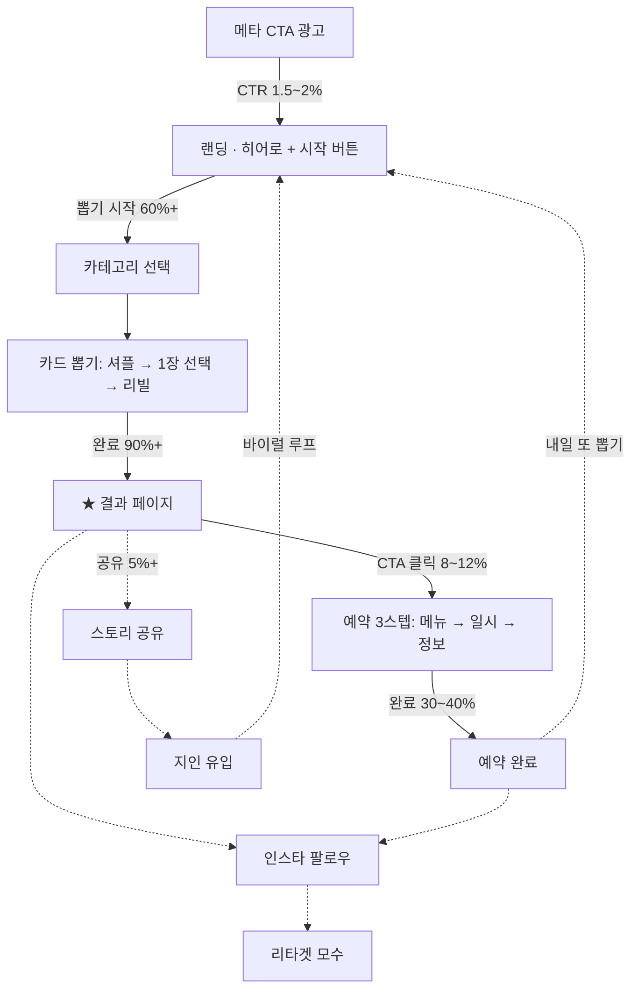

# 01. 유저플로우 기획

> 타로공방 인스타 바이럴 캠페인 — "오늘의 운세 타로카드 뽑기" 랜딩페이지
> 작성일: 2026-07-14 · 상태: **v1 확정 (핵심 결정 3건 반영 완료, §9 참고)**

---

## 1. 캠페인 골격

| 구분 | 내용 |
|---|---|
| 유입 | 메타 CTA 광고 (인스타 피드 · 스토리 · 릴스 지면) |
| 랜딩 | 오늘의 운세 타로카드 뽑기 (무료, 30초 체험) |
| **주 전환** | 1:1 타로리딩 예약 |
| 보조 전환 | 인스타그램 팔로우 (리타겟 모수 확보) |
| 바이럴 루프 | 결과 카드 이미지 스토리 공유 → 지인 오가닉 유입 |

### 설계 원칙 5가지

1. **선(先)가치 후(後)요구** — 입력 없이 운세부터 제공한다. 연락처는 예약 시점에만 받는다.
2. **30초 룰** — 광고 클릭부터 운세 결과 확인까지 30초 이내.
3. **모바일 온리** — 메타 유입은 사실상 100% 모바일. 세로 화면 한 손 조작 기준으로 설계.
4. **예약 CTA 상시 노출** — 결과 페이지 이후 모든 화면에 하단 고정 예약 버튼.
5. **운세는 하루 고정** — 재뽑기 시 결과가 바뀌면 '운세'의 신뢰가 무너진다. (§9 결정사항)

---

## 2. 전체 퍼널 맵

※ 수치는 전부 **초기 가설**. 라이브 후 실측으로 교체하고, 병목 구간부터 개선한다.

---

## 3. 메인 플로우 — 화면별 상세

### S0. 메타 광고 (유입)

- 크리에이티브: 메인 캐릭터 + 뒤집힌 카드 + "오늘 당신에게 온 카드는?"
- CTA 버튼: **더 알아보기** → 랜딩 URL (UTM 부착)
- 타겟: **공방 반경 지역 타겟팅 필수** (대면 전용 운영 결정 — §9). 전국 노출은 팔로우/공유 목적 캠페인으로 분리
- 상세 타겟/소재 기획은 12단계에서. 단, **광고 카피가 랜딩 첫 화면 카피와 톤이 이어져야** 이탈이 적다 (scent 유지).

### S1. 랜딩 진입 (첫 3초가 승부)

| 항목 | 내용 |
|---|---|
| 목적 | 이탈 없이 뽑기 시작 버튼을 누르게 한다 |
| 구성 | 캐릭터 + 한 줄 카피("오늘의 카드 한 장, 무료로 뽑아보세요") + [카드 뽑기 시작] 버튼 |
| 핵심 UX | 스크롤 없이 첫 화면에서 바로 시작 가능. 회원가입 · 입력 요구 일절 없음 |
| 이탈 방지 | 로딩 3초 이내(이미지 경량화), 첫 화면에 버튼 1개만(선택지 최소화) |

### S2. 카테고리 선택 (개인화 라이트)

- "오늘 어떤 이야기가 궁금하세요?" — 4택1
  - 💘 연애 / 💰 금전 / 💼 일 · 성장 / ✨ 오늘의 총운
- 의도: 입력 부담 없이 "내 얘기"라는 몰입을 만든다 → 결과 체감도↑ → 예약 전환 소재↑
- 선택한 카테고리는 결과 해석 + 예약 페이지 문구에 그대로 이어 쓴다 (예: 연애 선택자에겐 "연애 집중 리딩" 추천)

### S3. 카드 뽑기 인터랙션

1. 셔플 애니메이션 (약 1.5초 — 기대감 형성, 스킵 불가할 만큼만 짧게)
2. 카드 부채꼴 펼침 → **유저가 직접 1장 터치** (직접 선택 = 참여감 + 결과 수용도의 핵심)
3. 카드 플립 리빌

### S4. 결과 페이지 ★ (캠페인의 심장)

모든 전환과 바이럴이 이 페이지에서 갈라진다. 구성 순서(위→아래):

1. 리디자인된 카드 아트 풀샷 (6단계 산출물이 여기서 소비됨)
2. 카드 이름 + 오늘의 키워드 3개
3. 카테고리 맞춤 해석 3~4문장 (단정 아닌 공감형 톤 — 메타 정책상 개인 속성 단정 문구 금지, §8)
4. 행운 컬러 · 행운 아이템 (가벼운 재미 + 공유 이미지 소재)
5. **[결과 이미지 저장]** — 스토리 공유용 9:16 이미지 자동 생성 (계정 핸들 + "너도 뽑아봐" 워터마크 포함)
6. 브릿지 카피: "이 카드가 오늘 당신에게 온 이유, 더 깊이 들어볼까요?"
7. **[1:1 타로리딩 예약하기]** — 하단 고정 CTA
8. 인스타 프로필 링크 (팔로우 소프트 유도)

### S5. 예약 플로우 (3스텝, 각 스텝 1화면)

| 스텝 | 내용 | 이탈 방지 장치 |
|---|---|---|
| ① 메뉴 선택 | 리딩 종류 · 소요시간 · 가격 카드형 UI | 카테고리 연동 추천 메뉴를 맨 위에 |
| ② 일시 선택 | 캘린더 — 관리자가 오픈한 슬롯만 노출 | 가장 빠른 가능 시간 하이라이트 |
| ③ 정보 입력 | 이름, 연락처, (선택) 궁금한 점 한 줄 | 필수 입력 2개뿐. 개인정보 동의 체크(§8) |

→ 예약 신청 완료 (관리자 확정 후 안내 발송 — 8단계에서 확정/알림 방식 상세 설계)

### S6. 완료 & 리텐션

- 예약 내용 요약 + "확정 안내는 카톡/문자로 드려요"
- **공방 위치 · 오시는 길 안내** (대면 리딩 — 지도 링크, 주차/대중교통 팁)
- 인스타 팔로우 유도: "리딩 전에 피드에서 오늘의 시그널을 미리 만나보세요"
- 재방문 훅: "내일의 카드도 준비되어 있어요 — 링크를 저장해두세요"

---

## 4. 서브 플로우 (3개의 루프)

### A. 공유 바이럴 루프 (오가닉 유입)
결과 페이지 → 이미지 저장 → 인스타 스토리 업로드 → 스토리 열람한 지인 → 랜딩 유입
- 공유 이미지에 **계정 핸들 + 랜딩 안내**가 박혀 있어야 루프가 닫힌다.

### B. 팔로우 회수 루프 (예약 안 한 유저)
결과만 보고 이탈 → 프로필 방문/팔로우 → 피드 콘텐츠(운세 · 후기) 노출 → 리타겟 광고 모수
- 예약 전환율이 한 자릿수인 이상, **이탈자의 팔로우 전환이 캠페인 ROI의 절반**을 만든다.

### C. 재방문 루프 (데일리 습관화)
- 하루 1회 고정: 같은 날 재접속 시 "오늘의 카드는 이미 도착했어요" + 아침 결과 재노출
- 자정 리셋 → "내일 다시" — 오늘의 운세를 데일리 습관으로 만든다.

---

## 5. 관리자(공방) 운영 플로우

1. 유저 예약 신청 → 관리자 알림 수신
2. 관리자탭에서 신청 목록 확인 → 확정 / 시간 조정 / 취소
3. 확정 시 유저에게 확정 안내 발송 (카톡 알림톡 or 문자 — 8단계에서 결정)
4. 예약 전날 리마인드 발송 (노쇼 방지)
5. 리딩 완료 → 후기 요청 → 후기는 피드 콘텐츠로 재활용 (10~11단계 소재 파이프라인)

---

## 6. 화면 목록 (IA — 7단계 랜딩 제작의 사양서)

| ID | 화면 | 핵심 요소 |
|---|---|---|
| S1 | 홈/히어로 | 캐릭터, 카피, 시작 버튼 |
| S2 | 카테고리 선택 | 4택1 버튼 |
| S3 | 카드 뽑기 | 셔플 → 선택 → 리빌 인터랙션 |
| S4 | 결과 | 카드 아트, 해석, 공유, 예약 CTA |
| S5-1~3 | 예약 3스텝 | 메뉴 / 캘린더 / 정보 입력 |
| S6 | 예약 완료 | 요약, 팔로우 유도, 재방문 훅 |
| A1 | 관리자 로그인 | |
| A2 | 예약 대시보드 | 신청 목록, 확정/취소 |
| A3 | 슬롯 관리 | 예약 가능 시간 오픈/마감 |
| A4 | 통계 | 유입 · 뽑기 · 예약 퍼널 수치 |

---

## 7. 측정 설계

### 퍼널 KPI (초기 가설 — 라이브 후 실측 교체)

| 구간 | 지표 | 초기 가설 |
|---|---|---|
| 광고 → 랜딩 | CTR | 1.5~2% |
| 랜딩 → 뽑기 시작 | 참여율 | 60%+ |
| 뽑기 → 결과 도달 | 완료율 | 90%+ |
| 결과 → 예약 CTA 클릭 | 클릭률 | 8~12% |
| CTA → 예약 완료 | 완료율 | 30~40% |
| 결과 → 이미지 저장/공유 | 공유율 | 5%+ |

### 메타 픽셀 이벤트 매핑 (7 · 12단계에서 구현)

| 시점 | 이벤트 |
|---|---|
| 랜딩 도착 | PageView |
| 뽑기 시작 | 커스텀 `draw_start` |
| 결과 도달 | ViewContent |
| 예약 스텝 진입 | InitiateCheckout |
| 예약 완료 | **Schedule** (최적화 목표 이벤트) |
| 이미지 저장 | 커스텀 `share_save` |

### UTM 규칙 (9단계 동기화 시 적용)

- 메타 광고: `utm_source=meta&utm_medium=paid&utm_campaign={캠페인}&utm_content={소재}`
- 인스타 바이오: `utm_source=instagram&utm_medium=bio`
- 스토리 공유 유입: `utm_source=instagram&utm_medium=share`
→ 유료/오가닉/바이럴 유입을 분리 측정해야 광고비 효율 판단이 가능하다.

---

## 8. 정책 · 법규 체크포인트

1. **메타 개인 속성 정책**: "당신 요즘 힘드시죠?"처럼 개인의 상태를 단정하는 광고 카피는 리젝 사유. 카피는 "오늘의 카드를 확인해보세요"처럼 행동 제안형으로. (랜딩 결과 해석 톤에도 동일 적용)
2. **개인정보 수집 동의**: 예약 시 이름 · 연락처 수집 → 수집 항목 · 목적 · 보유기간 고지 + 동의 체크박스 필수 (개인정보보호법).
3. **운세 콘텐츠 톤**: 의료 · 재정 관련 단정적 조언 금지. "재미 + 참고용" 포지션 유지.

---

## 9. 이 단계의 결정사항

| # | 항목 | 결정 (2026-07-14) |
|---|---|---|
| 1 | 뽑기 전 개인화 | ✅ **카테고리 4택1** (연애/금전/일/총운) |
| 2 | 리딩 운영 방식 | ✅ **대면만 (공방 방문)** |
| 3 | 재뽑기 정책 | ✅ **하루 1회 고정** (자정 리셋) |
| 4 | 예약 확정 방식 | ⏳ 8단계에서 상세 결정 (추천: 신청 후 관리자 확정) |

### "대면만" 결정의 파급 효과

- **광고(12단계)**: 예약 목적 캠페인은 공방 반경 지역 타겟 필수. 전국 노출은 팔로우·공유 목적으로 분리 운영
- **예약 플로우(S5)**: 대면/비대면 방식 선택 스텝 불필요 → 3스텝 유지
- **완료 페이지(S6)**: 공방 위치 · 오시는 길 안내 필수
- **지역 외 유입자**(오가닉 공유 유입): 예약 대신 **팔로우 전환에 집중** — 결과 페이지에서 두 CTA의 우선순위를 지역에 따라 바꿀 필요는 없지만, 콘텐츠로 붙잡아 두는 게 목표

---

## 10. 이 플로우가 다음 단계에 거는 요구사항

| 단계 | 이 플로우에서 나온 요구사항 |
|---|---|
| 02 이름 | 랜딩 도메인/핸들과 함께 쓸 수 있는 짧고 검색 가능한 이름 |
| 05 캐릭터 | S1 히어로 + S4 결과 해설자 역할. "카드를 건네주는 존재"로 설정 |
| 06 카드 | 모바일 세로 리빌 + 9:16 공유 이미지에서 예뻐야 함. 초기 리디자인 범위는 메이저 아르카나 22장 권장 |
| 07 랜딩 | §6 화면 목록 = 페이지 사양. §7 픽셀 이벤트 포함 구현 |
| 08 예약 | §5 관리자 플로우 + A1~A4 화면. 알림(알림톡/문자) 채널 결정 필요 |
| 10~11 피드 | 후기 파이프라인(§5-5) + 오늘의 카드 데일리 포맷 연동 |
| 12 광고 | Schedule 이벤트 최적화, 소재-랜딩 카피 일관성(§3-S0), **공방 반경 지역 타겟팅** |
